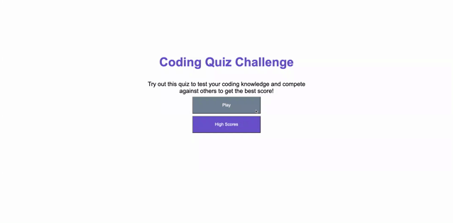

# Code Quiz

## Description

A short quiz meant to test basic coding knowledge.

- My motivation when building this project was to create a short quiz using Javascript that would cycle through an array of questions and, based on answers, either add to a user's score or subtract time from the timer.

- I built this project to further my knowledge of Javascript and jQuery, and practice implementing them. 

- I learned a lot while doing this project! It definitely helped me understand Javascript methods a lot more, especially when it comes to things like for loops and iteration, as well as local storage. 

## Usage 

- Use this application to test your knowledge of basic programming knowledge and compete for the best score.

## Screenshot of Deployed Application

## Link to Deployed Application

https://maiavelli.github.io/codequiz/